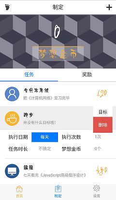
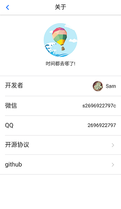

# 梦想启航
我对时间、工作与生活、梦想和目标的感悟之作！

## 介绍
工作与生活的平衡利器。

是否会有时间都去哪了的疑问呢？合理管理自己的时间，初开始可能会觉得很烦，很蠢；但是习惯之后便可以很好的平衡工作与生活。

是否会有迷茫、做事三天打鱼两天晒网呢？有目标便不会迷茫，而通往目标的道路需要持之以恒，想要不被诱惑击倒，就要制定一个更大的诱惑。

这款应用会相对自由的分配时间，让你得到目标完成之后的喜悦与奖励。

## 功能
* 制定任务，任务分为三种类型：倒计时、无限制、不确定时间（从零开始计时）；想要完成一个时间特别长的任务，比如`8小时`，是不间断的做完，还是把任务时间分隔开，变成一小段一小段的时间片段，每执行完一个片段，就休息一会呢？根据以往的实践我决定选择后一种，这也是我为什么开发这个应用的原因（其实是因为懒···），下面介绍下这三种类型的应用场景：
  1. 倒计时，应用于上面这段所讲的场景，会很有用；但是休息时间和片段的执行时间，这里面的关系，现在的方法是按照`restTime = execTime * 20%`来处理，比值觉得还是不太正确，希望大家能提出建议改善。
  2. 无限制，有些任务不能，或者说不适合用时间来达到完成条件，比如有一个想要提升对话能力的目标，就只能自己判定是否完成。
  3. 不确定时间，比如跑步，并不确定要跑多久，时间不固定。
 * 制定奖励，坚持的动力是什么？我的观点：需要有奖励，比如言语，物质等。所以设定了奖励制度，通过完成任务获得金币，然后达成条件，获取自己设定的奖励（为什么是自己设定···）。

## 说明
* 使用了[DCloud](http://www.dcloud.io/)来进行开发的`HTML5`应用。
* 使用了[Vue](https://cn.vuejs.org/)作为主要开发工具，插件[Vue-router](https://router.vuejs.org/zh-cn/)和[Vuex](https://vuex.vuejs.org/zh-cn/)。
* 使用了[MUI](http://dev.dcloud.net.cn/mui/)框架来辅助开发，要吐槽下`MUI`源码，有些不合理或者说结合`Vue`使用的坑点：
  1. 有些变量没有声明。
  2. 变量声明放在一起，`var a = b = c = null`改了好多处。
* 使用了阿里的图标字体。
* 使用了两份字体文件`number.ttf`和`normal.ttf`，一份用于显示数字，另一份用于正常显示中文字体。
* 使用了`SCSS`预编译器，但是语法方面没有用，主要是为了方便优先级。

## 开发难点
* 对我来说最难的应该就是原生的部分了，虽然`DCloud`有`Native.js`可以用`JavaScript`语法开发；但是也是要明白原生的原理和语法的，可我都不懂，只能先在官网看别人写的例子，在对照着原生的语法翻译了；有些时候其实会觉得有点脱裤子放屁的赶脚！
* 日期如何存储和读取呢？我的经验如下：
  1. 所有日期格式为`*-*-*-*`，第一个`*`表示`年`，第二个`*`表示`月`，第三个`*`表示`天`，第四个`*`表示`周`；一个`一次性计划`的例子`2017-6-20-*`，表示`2017年的6月20日`。
  2. `每天`的格式为`*-*-*-*`，`每周`的格式为`*-*-*-日`，`每月`的格式为`*-*-17-*`。
  3. `每年`的格式稍有不同，因为我设置了一个`多选`的选项，所以`单选`为`*-6-9-*`表示`每年的6月9日`，`多选`为`*-6-*-*`表示`每年的6月`。
  4. 保存的方式为数组形式，因为`indexedDB`数据库支持数组索引，可以把数组的每个值解析为索引，并且都是同一个`ID`的内容。
  5. 在`首页`想要读取当天所有计划，会有优先级，并且按照`重复性`来设定；`一次性计划`优先级最高显示在顶部；`每天`的`重复性`最高，因此优先级最低。

## 知识经验
1. 日历组件，原本以为这个挺难开发的，自己开发之后发现还是挺简单的，额`囧`；开发中有个实践：底层提供`API`，获取日期的`数据数组`，之后的样式就可以随意修改了。
2. 重复日期，这个东西初开始做只想到了存储的格式，但是存储的数据结构并没有考虑清楚；之后摸索发现数组合适，原因上文有写。
3. 铃声提醒，本来开始`技术选型`想用`Weex`的，但是发现不知道怎么做这个功能，瞬间就懵逼了···。最后选择了`DCloud`平台。
4. 本地存储，此应用使用了两种方式`localStorage`和`indexedDB`，其中`indexedDB`有些复杂，两种方式我都做了一个封装可以在`src/common/js`中看到；封装的有点渣，也就只能做个参考了。
5. `Vue-router`子路由，这个还是挺有趣的，不过使用了路由，数据的通信是肯定要借助`Vuex`了。
6. 倒计时，好吧开始我也觉得挺复杂的，和日期相关的我都觉得复杂···。之后发现也挺简单的，额！主要代码就是下面这段了：
```javascript
let value = {
  days: addLeftZero( parseInt( diffTime / 1000 / 60 / 60 / 24, 10 ) ),
  hours: addLeftZero( parseInt( diffTime / 1000 / 60 / 60 % 24, 10 ) ),
  minutes: addLeftZero( parseInt( diffTime / 1000 / 60 % 60, 10 ) ),
  seconds: addLeftZero( parseInt( diffTime / 1000 % 60, 10 ) ),
};
```
7. 拷贝对象，有个简便的方式，通过`JSON`的两个转换方法实现：
```javascript
JSON.parse( JSON.stringify( obj ) );
```

## 运行准备
### 打包路径
```javascript
build: {
  env: require('./prod.env'),
  index: path.resolve(__dirname, '../dist/index.html'),
  assetsRoot: path.resolve(__dirname, '../dist'),
  assetsSubDirectory: 'static',
  // 下面本来的值是 '/'，被我改成了 './'，原因是打包之后资源的路径并不正确，如果是直接在服务器上运行应当没有问题。
  assetsPublicPath: './',
  productionSourceMap: true,
  // Gzip off by default as many popular static hosts such as
  // Surge or Netlify already gzip all static assets for you.
  // Before setting to `true`, make sure to:
  // npm install --save-dev compression-webpack-plugin
  productionGzip: false,
  productionGzipExtensions: ['js', 'css'],
  // Run the build command with an extra argument to
  // View the bundle analyzer report after build finishes:
  // `npm run build --report`
  // Set to `true` or `false` to always turn it on or off
  bundleAnalyzerReport: process.env.npm_config_report
},
```

### `eslint`设置
```json
// add your custom rules here
'rules': {
  // allow paren-less arrow functions
  'arrow-parens': 0,
  // allow async-await
  'generator-star-spacing': 0,
  // allow debugger during development
  'no-debugger': process.env.NODE_ENV === 'production' ? 2 : 0,
  // my set
  'semi': [2, "always"],
  'space-in-parens': ["error", "always"],
  'comma-dangle': ["error", "always-multiline"],
  'space-before-function-paren': ["error", {"anonymous": "always", "named": "never", "asyncArrow": "always"}],
}
```

## 应用界面






## 怎么使用
``` bash
# 安装
npm install

# 运行热加载在 localhost:8080 端口
npm run dev

# 最小化打包
npm run build
```
